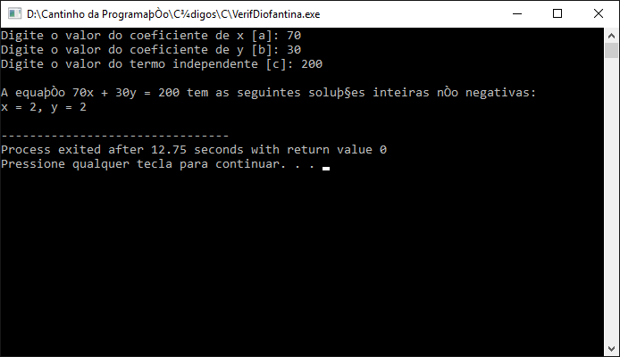

# Equação Diofantina

**Mário Leite**

---

Um tipo de classificação das equações matemáticas é quanto a ser: **Lineares** ou **Não Lineares**. Nas equações lineares os expoentes das incógnitas (ou variáveis) são todos iguais a 1; isto significa que as variáveis aparecem como sendo do primeiro grau, sem estarem elevadas a potências maiores que 1 ou envolvidas em outras operações não lineares. Por outro lado, é importante frisar que o principal objetivo prático das equações diofantinas é buscar soluções inteiras para equações algébricas.

Uma equação do tipo linear muito importante em várias aplicações práticas é a **Equação Diofantina**, que é uma equação polinomial em que as soluções são restritas a números inteiros (o nome vem do matemático grego Diofanto de Alexandria, que estudou esse tipo de equação). A forma mais comum desse tipo de equação linear é a seguinte:

ax + by = c

ruby
Copiar
Editar

onde `a`, `b`, `c` são constantes inteiras e `x` e `y` variáveis, também inteiras, e cuja solução é baseada na expressão: `ax + by = MDC(a, b)`.

E como exemplo de aplicação prática, vamos considerar a seguinte situação real que impacta o nosso dia a dia na economia doméstica:

> “Com R$ 200 disponíveis (semanalmente) quantos quilos de café e quantos ovos podemos comprar, considerando que o café custa R$ 70/kg e os ovos R$ 30/dz?”

**Dinheiro disponível:** R$ 200  
**Café:** R$ 70/kg &rarr; quantidade representada por `x`.  
**Ovos:** R$ 30/dz (12 ovos) &rarr; quantidade representada por `y`.

Neste caso, a equação diofantina fica assim:

70x + 30y = 200

yaml
Copiar
Editar

---

## Passo a Passo para Resolver

### Passo 1: Verificar a existência de soluções inteiras

Simplificando a equação dividindo todos os termos por 10:

7x + 3y = 20

go
Copiar
Editar

Agora, é preciso encontrar valores inteiros de `x` e `y`.

### Passo 2: Expressar `y` em termos de `x`

y = (20 - 7x) / 3

objectivec
Copiar
Editar

Para que `y` seja inteiro, o numerador `(20 - 7x)` deve ser múltiplo de 3.

### Passo 3: Encontrar valores inteiros de `x` e `y`

Testando valores inteiros de `x` para ver se `(20 − 7x)` é múltiplo de 3:

| x   | 20 - 7x | y = (20 - 7x) / 3 | Inteiro? |
| --- | ------- | ----------------- | -------- |
| 0   | 20      | 6,67              | Não      |
| 1   | 13      | 4,33              | Não      |
| 2   | 6       | 2,00              | Sim      |
| 3   | -1      | 0,33              | Não      |

Portanto, a única solução válida é: `(x, y) = (2, 2)`, ou seja:

- **2 kg de café** (R$ 140 total)
- **2 dúzias de ovos** (R$ 60 total)

Custo total = 140 + 60 = 200

---

**Conclusão:**  
Com R$ 200, a única solução possível para comer ovos no almoço e tomar um cafezinho depois da refeição é comprar 2 kg de café e 2 dúzias de ovos; mais nada (picanha, nem pensar!).

O programa “VerifDiofantina” apresenta uma solução codificada para o uso desse tipo de equação em situações práticas, e a **Figura 1** mostra o resultado da simulação desejada.

---



---

## Código Fonte: VerifDiofantina.C

```c
//VerifDiofantina.C
//Aplica a equação Diofantina para resolver um problema prático.

#include <stdio.h>
#include <stdlib.h>
#include <string.h>
#include <ctype.h>

//----------------------------------------------------------------------------
// Função para calcular o MDC (Máximo Divisor Comum)
int mdc(int a, int b) {
    while (b != 0) {
        int temp = b;
        b = a % b;
        a = temp;
    }
    return a;
}

//----------------------------------------------------------------------------
// Função para encontrar e exibir as soluções da equação Diofantina
void FunSolucoes(int a, int b, int c) {
    int d = mdc(a, b);

    // Verifica se a equação tem solução
    if (c % d != 0) {
        printf("A equação %dx + %dy = %d não tem soluções inteiras não negativas.\n", a, b, c);
        return;
    }

    // Encontrar uma solução particular (x0, y0)
    int x0 = 0, y0 = 0;
    for (int x = 0; x <= c / a; x++) {
        if ((c - a * x) % b == 0) {
            x0 = x;
            y0 = (c - a * x) / b;
            break;
        }
    }

    // Exibir todas as soluções não negativas
    printf("A equação %dx + %dy = %d tem as seguintes soluções inteiras não negativas:\n", a, b, c);
    int t = 0;
    while (1) {
        int x = x0 + (b / d) * t; // solução geral para x
        int y = y0 - (a / d) * t; // solução geral para y

        // Verifica se x e y são não negativos
        if (x >= 0 && y >= 0) {
            printf("x = %d, y = %d\n", x, y);
        } else {
            break; // interrompe o loop quando y se torna negativo
        }
        t++;
    }
}

//============================================================================
int main() {
    int a, b, c;

    // Entrada de dados
    printf("Digite o valor do coeficiente de x [a]: ");
    scanf("%d", &a);
    printf("Digite o valor do coeficiente de y [b]: ");
    scanf("%d", &b);
    printf("Digite o valor do termo independente [c]: ");
    scanf("%d", &c);

    // Verifica se a e b são diferentes de zero
    if (a == 0 || b == 0) {
        printf("Os coeficientes a e b não podem ser zero.\n");
        return 1;
    }

    printf("\n");
    // Encontrar e exibir as soluções
    FunSolucoes(a, b, c);  // chama a função para achar a solução

    return 0;
}  // fim do programa
```
